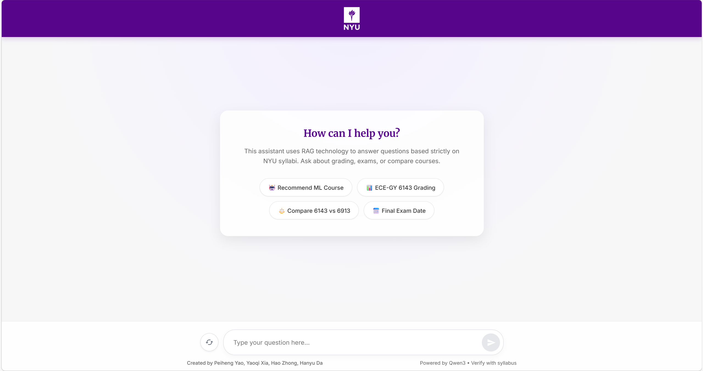
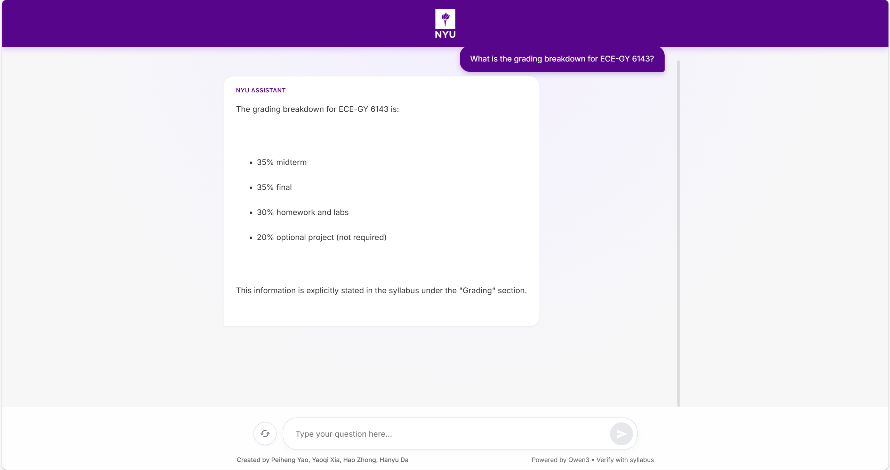
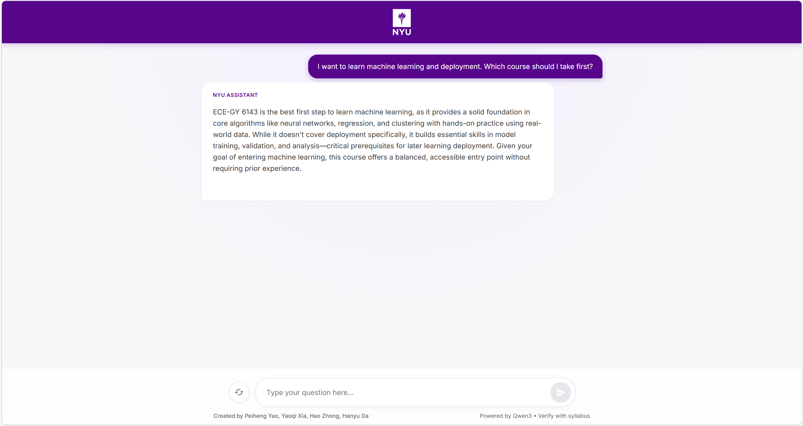
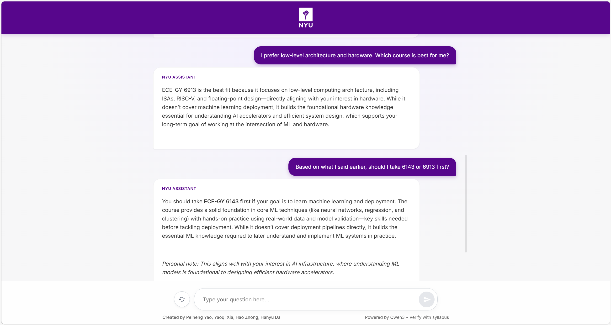
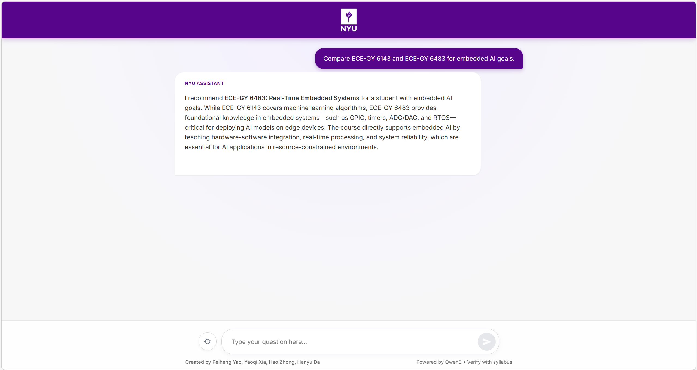
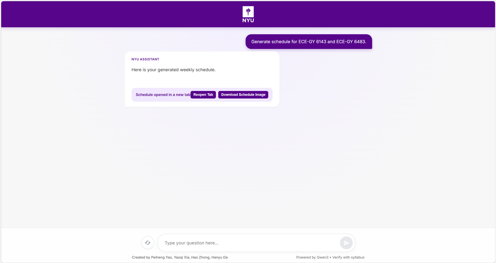
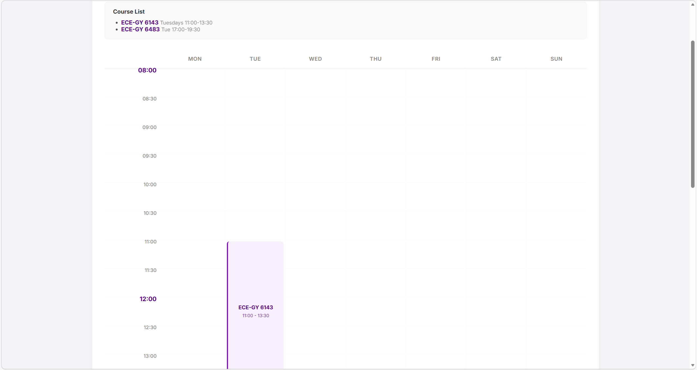
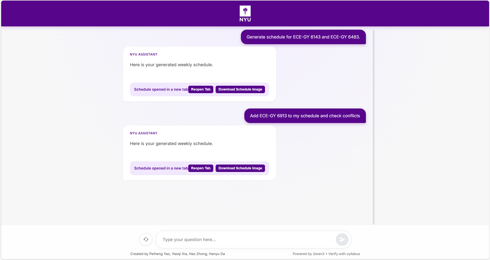
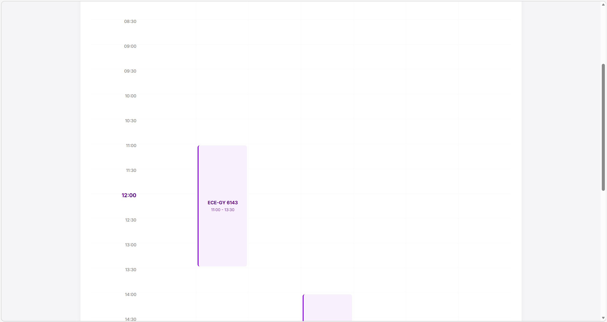

# NYU Course Advisor (Flask + Local Qwen + RAG)

An NYU syllabus Q&A and course advising assistant with:
- local LLM inference (OpenAI-compatible Qwen API)
- syllabus RAG (FAISS + E5 embeddings + lexical fallback)
- conversation memory
- schedule generation and conflict detection

## Features

- Intent-based routing with confidence fallback.
- Hybrid retrieval (`dense + lexical`) with debug traces.
- Syllabus-grounded answers (grading, exams, prerequisites, materials, etc.).
- Recommendation flows:
  - course selection
  - course comparison
- Memory-aware chat for multi-turn personalization.
- Weekly schedule generation (HTML timetable + conflict list).
- Smoke test script for end-to-end API checks.

## Feature Screenshots

### Main Chat
<p align="center">
  
</p>

### Syllabus RAG (Grading Retrieval)
<p align="center">
  
</p>

### Selection Recommendation
<p align="center">
  
</p>

### Selection With Memory (History-Aware)
<p align="center">
  
</p>

### Comparison (Dual Course)
<p align="center">
  
</p>

### Schedule (Create / Replace)
<p align="center">
  
</p>
<p align="center">
  
</p>

### Schedule (Incremental Add + Conflict Check)
<p align="center">
  
</p>
<p align="center">
  
</p>

## Project Structure

- `app.py`: Flask entrypoint and request routing.
- `qwen_client.py`: OpenAI-compatible HTTP client for local Qwen.
- `rag_module.py`: intent classification, query rewrite, retrieval, rerank, retrieval debug state.
- `advisor_module.py`: response generation for syllabus QA, selection, comparison, memory-only chat.
- `memory_module.py`: memory persistence and retrieval (`memory_store/*`).
- `ingest_syllabi.py`: PDF chunking + embedding + FAISS indexing.
- `schedule_module.py`: schedule intent handling and HTML generation orchestration.
- `course_scheduler.py`: meeting parser + conflict detection + grid builder.
- `course_db.py`: course metadata lookup for schedule completion.
- `config/paths.py`: runtime config via env vars.
- `config/courses.json`: course metadata source.
- `templates/index.html`: web chat UI.
- `templates/schedule.html`: rendered timetable template.
- `scripts/start_local_qwen_vllm.sh`: start local Qwen (vLLM).
- `scripts/start_app_with_local_qwen.sh`: start Flask app with local Qwen defaults.
- `scripts/run_smoke_tests.sh`: API smoke tests.

## Pipelines

### 1) Request Routing Pipeline (`/ask`)

1. Read question.
2. Try schedule pipeline first (`schedule_module.try_generate_schedule_from_dialog`).
3. If not schedule, classify intent (`comparison`, `selection`, `syllabus`, `chat`) with confidence.
4. If low confidence (non-chat), fallback to syllabus RAG.
5. Generate answer via the corresponding advisor path.
6. Persist turn memory.

### 2) Retrieval Pipeline (RAG)

1. Rewrite query with Qwen (`refine_question_with_qwen`).
2. Retrieve candidates by:
   - dense search (FAISS + E5), if embedding model available
   - lexical search fallback / hybrid merge
3. Route dominant course (`explicit code -> keyword -> candidate vote`).
4. Apply rerank and snippet filtering.
5. Return contexts to advisor generation.

### 3) Schedule Pipeline

1. Detect schedule intent.
2. Extract course codes / course lines from user text.
3. Fill missing meetings/rooms from `config/courses.json` via `CourseDB`.
4. Build weekly grid and detect conflicts.
5. Return `schedule_html` + conflicts (or ask for missing info).

## Requirements

- Python `>= 3.10`
- CUDA-capable GPU recommended for local Qwen (CPU mode is not practical for this setup)

Install Python dependencies:

```bash
pip install flask requests sentence-transformers faiss-cpu numpy pypdf pytest vllm
```

## Quick Start

### 1) Create and activate virtual environment

```bash
python3 -m venv .venv
source .venv/bin/activate
```

### 2) Build vector store from syllabus PDFs

Put PDF files under `docs/syllabus/`, then run:

```bash
python3 ingest_syllabi.py
```

Outputs:
- `vector_store/index.faiss`
- `vector_store/texts.json`
- `vector_store/ingest_manifest.json`

### 3) Start local Qwen API (vLLM)

```bash
QWEN_MODEL_NAME=Qwen/Qwen3-4B-Instruct-2507-FP8 ./scripts/start_local_qwen_vllm.sh
```

Default API endpoint:
- `http://127.0.0.1:8000/v1/chat/completions`

Health check:

```bash
./scripts/check_local_qwen.sh
```

### 4) Start Flask app

In another terminal (same `.venv`):

```bash
./scripts/start_app_with_local_qwen.sh
```

Default URL:
- `http://127.0.0.1:5000`

## API Reference

### `POST /ask`

Request:

```json
{ "question": "For ECE-GY 6143, what is the grading breakdown?" }
```

Typical response:

```json
{
  "answer": "...",
  "request_id": "...",
  "intent": "syllabus"
}
```

When schedule pipeline is triggered, response may also include:
- `schedule_html`
- `conflicts`
- `candidates`

### `POST /debug_retrieval`

Returns:
- refined query
- retrieved contexts
- `rag_module.LAST_RETRIEVAL_DEBUG`

### `POST /reset_memory`

Clears memory store.

### `POST /log_memories`

Snapshots current memory to `memory_store/memory_export.log`.

## Testing

Unit tests:

```bash
pytest test.py -q
```

Integration tests (requires reachable local Qwen API):

```bash
QWEN_TEST_ENABLED=1 pytest test_integration_qwen.py -q -m integration
```

Smoke tests:

```bash
./scripts/run_smoke_tests.sh
```

## Key Environment Variables

From `config/paths.py`:

- `QWEN_API_URL` (default: `http://127.0.0.1:8000/v1/chat/completions`)
- `QWEN_MODEL_NAME` (default: `Qwen/Qwen3-4B-Instruct-2507-FP8`)
- `E5_MODEL_NAME` (default: `intfloat/multilingual-e5-large`)
- `E5_LOCAL_ONLY` (default: `1`)
- `INTENT_CONFIDENCE_THRESHOLD` (default: `0.60`)
- `RESET_MEMORY_ON_INDEX` (default: `0`)
- `ENABLE_REQUEST_LOG` (default: `1`)
- `MEMORY_REINDEX_EVERY` (default: `5`)

## Notes

- If your GPU has limited VRAM (e.g., 8GB), keep model size small (4B class) and reduce vLLM memory utilization when needed.
- For best schedule behavior, keep `config/courses.json` updated with `schedule` and `location` fields.
- If retrieval seems weak, rebuild index with `python3 ingest_syllabi.py` and verify `vector_store/*` is fresh.

## License

Add your preferred license (e.g., MIT) before publishing.
